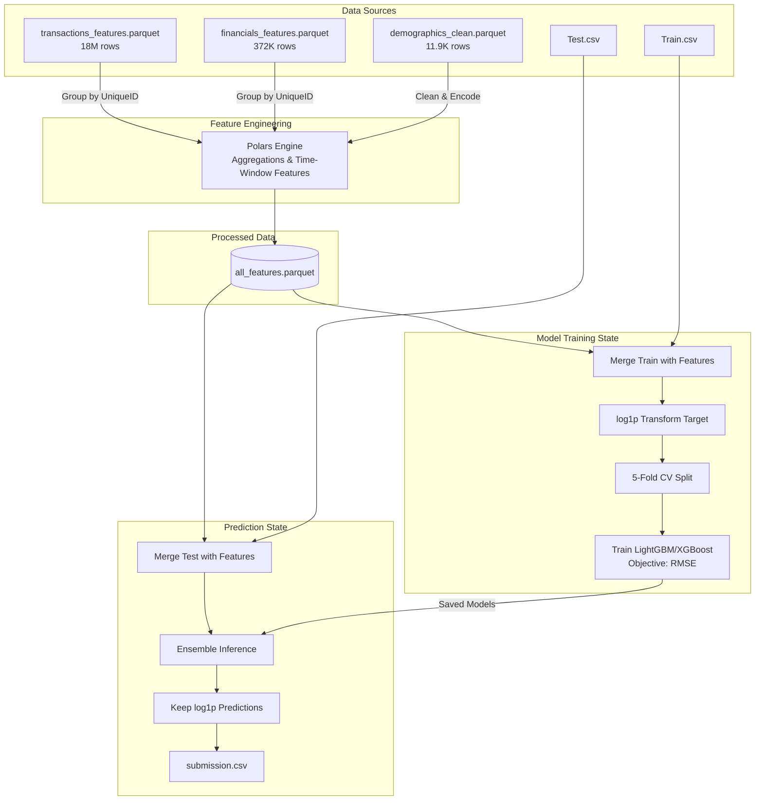

# Nedbank Transaction Volume Forecasting Challenge

## 📖 About the Challenge

Every day, millions of South Africans interact with their bank - swiping cards, making transfers, paying bills, receiving salaries. Behind each of these touch-points lies a rich behavioural signal. For Nedbank, one of South Africa's Big 4 banks, understanding and anticipating customer transaction volumes is a foundational capability: it drives capacity planning, fraud detection, product development, and personalised service delivery. 

The question is deceptively simple - **how many transactions will a given customer make in the next three months?** - but the answer demands genuine data science skill.

In this challenge, you are provided with anonymised behavioural data for nearly 12,000 Nedbank customers spanning up to 34 months of transaction history, monthly financial snapshots, and cleaned demographic profiles. Your task is to predict `next_3m_txn_count` - the total number of bank transactions each customer will make over a future three-month window (November 2015 through January 2016). This is a regression problem scored using **Root Mean Squared Logarithmic Error (RMSLE)**, a metric that penalises large relative errors and handles the right-skewed distribution of transaction counts gracefully.

What makes this challenge compelling is its real-world texture. The data is not clean-room synthetic - it has the quirks of production banking data: high-cardinality free-text descriptions, partial nulls in income fields, seasonality effects from the November to January holiday period, and customers whose behaviour varies wildly from month to month. Success will reward thoughtful feature engineering, careful handling of temporal patterns, and models that generalise rather than memorise. The top 25 participants on the virtual leaderboard will be invited to an in-person finale event hosted by Nedbank, where they will compete for the prize pool and the chance to present their approaches to Nedbank's data science leadership.

---

## 📊 Data Overview & Notes

The dataset contains anonymised behavioural data for **11,944 Nedbank customers**. It spans up to 34 months of transaction history (December 2012 through October 2015), monthly financial snapshots, and cleaned demographic profiles. 

- **Prediction Window**: The prediction window (November through January) spans the South African holiday season - consider seasonality effects carefully.
- **Transaction Amount**: `TransactionAmount` is signed: negative values indicate debits, positive values indicate credits.
- **Target Variable**: `next_3m_txn_count` (non-negative integer).
- **Evaluation Metric**: RMSLE (Root Mean Squared Logarithmic Error).
- **Submission Format**: submit `np.log1p(predicted_count)` in `next_3m_txn_count`, not raw counts.
- **Data Quality**: This is real-world banking data. As with any production dataset, you should expect missing values, inconsistencies, and fields that require careful inspection. Thoughtful data exploration and cleaning will be rewarded. No target leakage is present in the feature tables.

### File Structure & Sizes

| File | Type | Rows | Description |
|------|------|------|-------------|
| **Train.csv** | CSV | 8,360 | Training labels (customer IDs + target transaction counts) |
| **Test.csv** | CSV | 3,584 | Test customer IDs for which to predict |
| **SampleSubmission.csv** | CSV | 3,584 | Submission template |
| **transactions_features.parquet** | Parquet | 18M | Historical transaction records (Dec 2012 – Oct 2015) |
| **financials_features.parquet** | Parquet | 372K | Financial snapshots (Dec 2013 – Oct 2015) |
| **demographics_clean.parquet** | Parquet | 11,944 | Customer demographic profiles (1 row per customer) |
| **VariableDefinitions.csv** | CSV | - | Data dictionary for all columns |

---

## ⚙️ Machine Learning Pipeline Architecture

Below is the state-machine/data flow diagram detailing how the raw banking data is processed, engineered, and fed into the machine learning models.



---

## 🚀 Quick Start & Project Structure

Our Docker-based reproducible workflow is structured as follows:

```text
bank-transaction-volume-forecast/
├── data/
│   ├── inputs/         # Raw parquet and CSV files
│   └── processed/      # Engineered features output
├── notebooks/
│   └── 01-EDA.ipynb    # Exploratory Data Analysis & Seasonality Checks
├── src/
│   ├── features.py     # Polars script for high-performance feature extraction
│   ├── train.py        # LightGBM training with K-Fold CV & log1p transform
│   └── predict.py      # Inference script generating submission.csv
├── run_pipeline.py     # Orchestrator to run the entire workflow end-to-end
├── docker-compose.yml
└── requirements.txt
```

### Running the Pipeline

Ensure you have your data located in `data/inputs/`. Since the repository includes a Dockerized environment, you can run the entire ML pipeline automatically:

1. Spin up the environment (if not already running):
   ```bash
   docker compose up -d
   ```
2. Execute the guarded full workflow:
   ```bash
   docker exec bank-transaction-volume-forecast-jupyter-1 python -u run_pipeline_all.py
   ```
   
This will process all 18 million transaction rows efficiently using Polars, merge them with demographics and financials, train the tree models plus report-only experimental sidecars, and output `submission_stacked.csv`. By default, `submission_stacked.csv` is the public-safe `lgbm + catboost + xgb` stack. Experimental models such as rolling, high-tail, xgb_deep, band_moe, seed bags, and the raw event temporal model are included in validation reports but cannot overwrite the final upload file unless `ALLOW_EXPERIMENTAL_STACK=1` is set. The upload file contains log-space `np.log1p` predictions as required by Zindi.

Useful switches:

```bash
docker exec -e RUN_ROLLING=0 -e RUN_HIGHTAIL=0 -e RUN_BAND_MOE=0 bank-transaction-volume-forecast-jupyter-1 python -u run_pipeline_all.py
docker exec -e RUN_SEED_BAG=1 -e SEEDBAG_MODELS=xgb -e SEEDBAG_SEEDS=101,202,303 bank-transaction-volume-forecast-jupyter-1 python -u run_pipeline_all.py
docker exec -e RUN_EVENT_TEMPORAL=1 -e EVENT_BATCH_SIZE=8 bank-transaction-volume-forecast-jupyter-1 python -u run_pipeline_all.py
docker exec -e ALLOW_EXPERIMENTAL_STACK=1 bank-transaction-volume-forecast-jupyter-1 python -u run_pipeline_all.py
```

Validation and diagnostics switches:

```bash
docker exec -e VALIDATION_STRATEGY=stratified_activity -e VALIDATION_REPEATS=1 bank-transaction-volume-forecast-jupyter-1 python -u run_pipeline_all.py
docker exec -e VALIDATION_STRATEGY=legacy_kfold bank-transaction-volume-forecast-jupyter-1 python -u run_pipeline_all.py
docker exec -e RUN_ALIGNMENT_DIAGNOSTICS=1 -e ADVERSARIAL_HOLDOUT_FRAC=0.20 bank-transaction-volume-forecast-jupyter-1 python -u run_pipeline_all.py
docker exec -e RUN_DIAGNOSTICS=0 bank-transaction-volume-forecast-jupyter-1 python -u run_pipeline_all.py
```

`VALIDATION_STRATEGY` supports `legacy_kfold`, `stratified_activity`, and `rolling_origin`. The default is `stratified_activity`, which stratifies folds by target band plus recent activity/lifecycle signals where those columns are available. `VALIDATION_REPEATS` is used by stack-level validation, while base model training keeps one five-fold partition so the saved fold-model contract remains unchanged. `RUN_ALIGNMENT_DIAGNOSTICS=1` adds a train/test adversarial holdout stress score, stack-weight stability diagnostics, and public-transfer calibration from known leaderboard results. Seed-bag and event-temporal stack candidates are ignored unless `RUN_SEED_BAG=1` / `ALLOW_SEED_BAG_STACK=1` or `RUN_EVENT_TEMPORAL=1` / `ALLOW_EVENT_TEMPORAL_STACK=1` is set, which prevents stale optional artifacts from entering a default report. `ALLOW_VALIDATION_UNPROVEN_STACK=1` can override guard failures only when `ALLOW_EXPERIMENTAL_STACK=1` is also set; candidates are sorted by public-calibrated validation score, and the default keeps the public-safe `lgbm + catboost + xgb` stack.

Public leaderboard artifacts are tracked separately from validation scores. When a submitted score is known, `src/public_artifacts.py` records the exact file hash in `data/processed/submission_public_registry.csv`, refreshes `submission_latest_public.csv`, and only replaces `submission_best_public.csv` when the scored file is at least as good as the previous public best. This prevents a worse retrain of the same scenario from silently overwriting the best upload artifact. Public improvements also write a score-reward event to `data/processed/reward_log.csv`: reward points are `round(RMSLE_improvement * 100000)`, with small/solid/major/breakthrough tiers. Validation-time discoveries are summarized separately in `data/processed/validation_reward_report.csv` and only receive report points if they improve the calibrated score while passing the alignment, band, adversarial, and weight-stability gates.

```bash
docker exec bank-transaction-volume-forecast-jupyter-1 python src/public_artifacts.py --submission submission_stacked.csv --score 0.389532356
```

After a full pipeline run, use the calibration sweep to create conservative leaderboard-test candidates without retraining the base models:

```bash
docker exec bank-transaction-volume-forecast-jupyter-1 python -u src/calibration_sweep.py
```

The sweep reads existing OOF/test predictions, tests small safe-stack blends with rolling/high-tail/band sidecars, applies cross-fitted residual calibration variants, and ranks candidates by local RMSLE, public-transfer risk, band residual gates, and test-distribution drift. It writes `data/processed/calibration_sweep_report.csv`, `data/processed/calibration_sweep_band_report.csv`, the top ranked submissions under `data/processed/calibration_sweep_submissions/`, and copies the first ranked file to `submission_calibration_best.csv` for convenient upload. Public rewards are still only logged after a submitted score is confirmed with `src/public_artifacts.py`.

When `RUN_DIAGNOSTICS=1` (default), the pipeline writes:

- `data/processed/validation_report.csv`
- `data/processed/public_alignment_report.csv`
- `data/processed/submission_public_registry.csv`
- `data/processed/reward_log.csv`
- `data/processed/validation_reward_report.csv`
- `data/processed/stack_weight_stability_report.csv`
- `data/processed/residual_calibration_report.csv`
- `data/processed/drift_report.csv`
- `data/processed/anomaly_scores_train.csv`
- `data/processed/prediction_intervals_oof.csv`

`RUN_EVENT_TEMPORAL=1` builds exact recent transaction-event tensors plus pooled older monthly context, trains the GPU GRU event model, writes `oof_event_temporal.csv` and `submission_event_temporal.csv`, then tests `lgbm + catboost + xgb + event_temporal` in stacking. It is off by default because the full 5-fold run is expected to take hours on a 6GB GPU.

Research scope note: the event-temporal GRU/attention model is the current supported sequence research path. TCNs and larger Transformers are future sequence-model candidates. GNNs are intentionally out of scope until the schema includes graph-worthy merchant, device, counterparty, or other entity-link fields beyond the current customer/account structure.

---

## 🔗 Resources & Local Scoring

- **Data Dictionary:** See `VariableDefinitions.csv`
- **Local Scoring:** You can evaluate locally against a reference dataset using:
  ```bash
  python evaluate.py submission.csv data/inputs/PublicReference.csv
  ```
- **Submission:** Upload `submission_stacked.csv` via the Zindi platform. The values must remain in log space.
